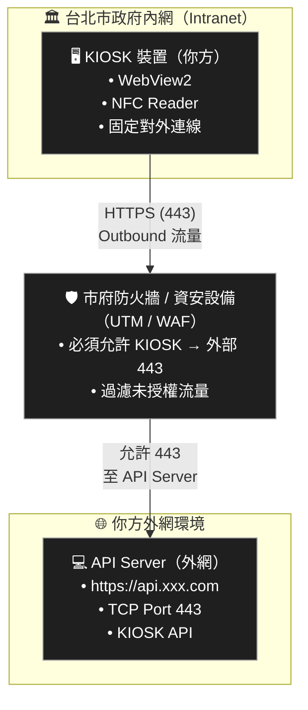

# almity

```mermaid
%% -----------------------------------------
%% GitHub Dark Theme Optimized Version
%% -----------------------------------------

flowchart TD
    %% 全域樣式：深色方塊 + 白字 + 粗框線
    classDef darkBlock fill:#1f1f1f,stroke:#999,stroke-width:1px,color:#fff;
    classDef titleBlock fill:#2a2a2a,stroke:#888,stroke-width:1px,color:#fff;

    %% 台北市政府內網
    subgraph GOV["🏛️ 台北市政府內網（Intranet）"]
        class GOV titleBlock
        KIOSK["🖥️ KIOSK 裝置（你方）<br/>• WebView2<br/>• NFC Reader<br/>• 固定對外連線"]
        class KIOSK darkBlock
    end

    %% 市府防火牆
    FIREWALL["🛡️ 市府防火牆 / 資安設備（UTM / WAF）<br/>• 必須允許 KIOSK → 外部 443<br/>• 過濾未授權流量"]
    class FIREWALL darkBlock

    %% 外網 API Server
    subgraph CLOUD["🌐 你方外網環境"]
        class CLOUD titleBlock
        APISERVER["💻 API Server（外網）<br/>• https://api.xxx.com<br/>• TCP Port 443<br/>• KIOSK API"]
        class APISERVER darkBlock
    end

    %% 連結線（白色字體）
    KIOSK -->|"HTTPS (443)<br/>Outbound 流量"| FIREWALL
    FIREWALL -->|"允許 443<br/>至 API Server"| APISERVER
```
